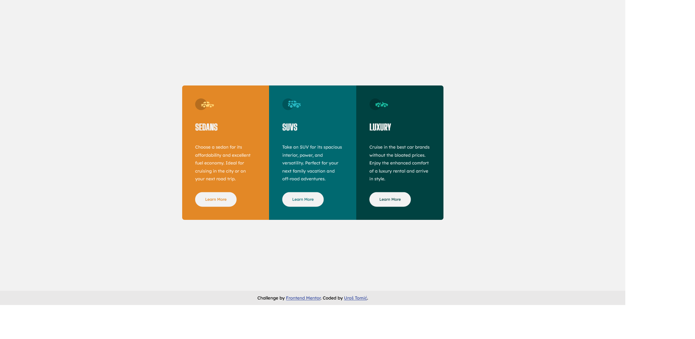

# Frontend Mentor - 3-column preview card component solution

This is a solution to the [3-column preview card component challenge on Frontend Mentor](https://www.frontendmentor.io/challenges/3column-preview-card-component-pH92eAR2-). Frontend Mentor challenges help you improve your coding skills by building realistic projects. 

## Table of contents

- [Overview](#overview)
  - [The challenge](#the-challenge)
  - [Screenshot](#screenshot)
  - [Links](#links)
- [My process](#my-process)
  - [Built with](#built-with)
  - [Useful resources](#useful-resources)
- [Author](#author)

## Overview

### The challenge

Users should be able to:

- View the optimal layout depending on their device's screen size
- See hover states for interactive elements

### Screenshot

### Links

- Solution URL: [https://www.frontendmentor.io/solutions/mobile-first-approach-with-sass-flexbox-and-css-grid-H-Z8k6NNX](https://www.frontendmentor.io/solutions/mobile-first-approach-with-sass-flexbox-and-css-grid-H-Z8k6NNX)
- Live Site URL: [https://mrgeminus.github.io/3-column-preview-card-component/](https://mrgeminus.github.io/3-column-preview-card-component/)

## My process

### Built with

- Semantic HTML5 markup
- CSS pre-processor (SASS)
- Flexbox
- CSS Grid
- Mobile-first approach
- BEM naming convention

### Useful resources

- [BEM](https://www.youtube.com/watch?v=er1JEDuPbZQ) - I really nice BEM explanation.

## Author

- Website - [Uros Tomic](https://mrgeminus.com/)
- Frontend Mentor - [@MrGeminus](https://www.frontendmentor.io/profile/MrGeminus)
- LinkedIn - [Uros Tomic](https://www.linkedin.com/in/mrgeminus/)
- Xing - [Uros Tomic](https://www.xing.com/profile/Uros_Tomic3/cv)
- StackOverflow - [MrGeminus](https://www.linkedin.com/in/mrgeminus/)
- Twitter - [@MrGeminus](https://twitter.com/MrGeminus)
